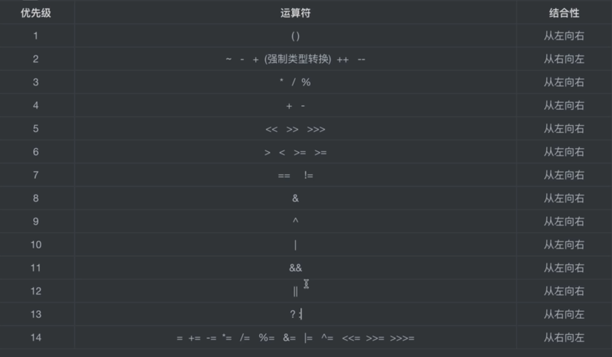

- [x] 已掌握：Java程序基本格式，编写注释，变量与常量,整数类型，二进制，浮点类型，字符类型,布尔类型
- [x] (java10)局部变量类型判断,赋值运算符，算术运算符,括号运算符，自增自减运算符,位运算
- [x] 关系运算符，逻辑运算符,代码块和作用域,选择结构，(java14)switch表达式,循环结构
- [x] (java9)交互式编程，类对象方法，this关键字,方法的重载和递归，构造方法
# 基本格式，注释
```java
/**
 * 这是文档注释
 * @author Melon 
 * @since 1999
 */
public class Main {
    //这是普通注释
    ///这是新版注释md.
    public static void main (String[] args ) {
        System.out.println();
        /*多行注释
          这是多行注释
         */
    }
}
//新版简化版
void main () {
    System.out.println();
}

```
# 整数类型
byte <short <int <long
```java
        byte a ;
        a = -128 ;
        int b = a + 1 , c = 2 ;
        int x = a ;
        final int p = 567 ; //final永久不变,设置一个常量
        System.out.println(x) ;
        System.out.println(b) ;
        System.out.println(c) ;
        System.out.println(p) ;
        long l = 763698271637892192L;  //右侧默认int,需要加L/l表示long类型
        int o = 0xa ;  //0x开头16进制
        int oo = 010 ;   //0开头是8进制
        System.out.println(o);
        System.out.println(oo);
        int max = 2147483647;
        max = max + 1 ;
        System.out.println(max);   //补码的原因导致最大变最小
```
# 浮点类型
byte < short(char) <int <long <float <double
```java
        double a = 1.53 , b = 33;
        float c = 10.9f;   //默认double,所以声明单精度时需要加f/F
        System.out.println(a) ;
        System.out.print(b);
        System.out.println(c);
        double z = c ;
        System.out.println(z);  //float转double会出现偏差(0.9时
        long l = 782814670000098082l;
        System.out.println(l);
        float ll = l ;       //float可以损失精度但是转化long
        System.out.println(ll);
```
# 字符类型
```java
        int c = '的';              //char只能单引号 单字符
        char a = '\'' ;             // 反斜杠表转义字符
        System.out.println(a);
        System.out.println(c);     //用int可以直接查看此字符的编码
        String X = "aaaa\nbbbb\"" ;        //String双引号 0-n个字符
        System.out.println(X);
```
# 布尔类型
```java
    boolean b = true ;      //布尔类型只有真或假
```
# (java10)局部变量类型判断
```java
        var i = 1.5 ;        //var关键字自动识别变量类型,但少用
        System.out.println(i);
```
# 赋值运算符
```java
    int a =  666 ;     //等号用来赋值
    int b = a =777 ;     //a = 777 的结果就是777(赋值运算有结果)
        System.out.println(a);
        System.out.println(b);
```
# 算术运算符
```java
 int a = 1 + 1 , c = 30 ;    //和平常计算一样
    int b = a + 20 - c ;
    System.out.println(a) ;
    System.out.println(b);
    //不同类型
        int d = 10 ;   //小类型会自动转化为大类型进行运算
        short o = 90 ;
        int p = d + o ;
        System.out.println(p);
        char ch = 'c' ;    //char会转化为编码来进行运算
        int ch2 = ch ;
        System.out.println(ch2);
        System.out.println(ch + a);
        float f1 = 9.9f;    //float和double不要直接加
        double f2 = 0.9;
        System.out.println(f2+a );
        String str1 = "abc" ,str2 = "cdf" ;
        System.out.println(a + 1.5 + str1 + str2 + a  + true);    //字符串可以用加法拼接，其他类型会自动变为字符串
        double i = 1d*8/5 ;      //运算中小数部分会被消除，需要专门声明double(坑点)
        System.out.println(i);
        /*其他运算符：%取余数
        优先级:正负号>乘除取模>加减>赋值
        赋值，正负号=从右往左,其余从按优先级从左往右
         */
```
# 括号运算符
```java
   //括号运算优先级最高,与数学中相同
int b = 128 ;
byte a = (byte)b ;             //强制类型转换，由大变小(有一定风险)
System.out.println(a);     //溢出只能保留8bit给byte
int c = 8 , d = 5 ;
double e = (double)c / d ;
System.out.println(e);
```
# 自增自减运算符
```java
int a = 1 ;
a = a + 1 ;
a++ ;          //效果就是a = a + 1
System.out.println(a);
a--;
System.out.println(a);
int b = ++a ;    //++在前，先自增再出结果,相当于a = a+1,b=a
System.out.println(b);
b = a++;        //++在后，先出结果再自增,相当于b = a ; a= a+1
System.out.println(b);
//自增自减运算符的优先级与正负号同级，从右往左
a+=4 ;         //效果就是a = a+4  ,乘法除法都能用 ，优先级与赋值相同
```
# 位运算
```java
//位运算偏底层（二进制）
int a = 9 ;       //与运算&:在二进制下进行比较，都是1就是1，否则是0
int b = 3 ;       //按位或|(回车键上面shift)：一个是1就是1
int c = a ^ b ;   //异或^:不一样才是1
System.out.println(c) ;
byte d = 127 ;
System.out.println(~d);  //取反~(对单个对象操作):1变0，0变1 高优先级
byte e = 1 ;
System.out.println(e<<3);    //位移运算,将1左/右移*位,每往左移1次，就翻2倍(2的次方计算)
//>>/<<左右移不会改变符号位   缩写c <<= 2 ; 
byte f = -1 ;
System.out.println(f>>>1); //无符号右移会考虑符号位 位移运算优先级低于加减
// & > ^ > | 优先级在位移之后
```

# 关系运算符
```java
int a = 10 , b = 10 ;
boolean c = a != b ;   //<,>,==,!=,>=,<=
System.out.println(c);

```
# 逻辑运算符
```java
int a = 10 ;
boolean b = a > 9 && a < 100 ;  //与位运算不同，要多一个符号&&
System.out.println(b);      //**逻辑短路:若前一个判断已经可得出结果，就不会进行后续运算，特殊：在布尔类型下使用单&位运算符，功能可以实现，但是不会短路
a = 99 ;
b = a < 0 || a >9 ;
System.out.println(!b); //!非运算取反
//三元运算符，类似与if/else
a = 10 ;
char c = a > 10 ? '成' : '不' ;
System.out.println(c);
```
# 优先级大表


# 代码块和作用域
```java
public class Main {
    public static void main (String[] args) {
    int a = 99 ;   //变量a在main中全局声明
    System.out.println(a);   //每个{}都是一个代码块，有自己的作用域
        {
            var b = 88;
            System.out.println(a);
            System.out.println(b);
        }
        System.out.println(b);  //此处执行错误，b变量的作用域仅存在于上面那个代码块中
    }
}
```
# 选择结构
```java
public class Main {
    public static void main (String[] args) {
        ////这里是if语句，使用与范围对应
    int a = 99 ;
    if (a > 99) System.out.println("hello!!Melon") ;   //格式if(出布尔类型结果的语句) 紧跟着判断为true执行的结果
        if (a == 99) {
            System.out.println("条件为真") ;
        System.out.println("第二句");
        }    //若要多行代码作为if的输出,则用代码块将其包裹
        else {        //else语句用来执行条件为假后执行的语句
            System.out.println("条件为假");
            System.out.println("这是下一句");
        }
//连续判断简单示例，用else if
            int score = 80 ;
            if (score > 90) {
                System.out.println("干得漂亮");
            } else if (score > 60) {
                System.out.println("有点小捞");      //if可以进行语句嵌套,进行更细分的判断
                if (score >70 && score < 80) {
                    System.out.println("快去学C");
                }else{
                    System.out.println("学python吧!");
                }
            }
                else if (score > 40) {
                    System.out.println("你可得好好学了");
                }else {
                    System.out.println("拉完了!!");
                }
            /////这里是switch语句，更适用于多分支结构与无范围对应
        /*
        switch结构:
        switch(传入一个值/变量/计算表达式){
            case 匹配值 :输出代码
                break;    //用break来作为代码的分界线,防止串行(重要，除非故意想要溜行)
            case 第二个匹配值:第二个代码
                break;
         */
        String people = "小D";
        switch (people) {
            case "小明" :
                System.out.println("你是小明");
                System.out.println("you are a good boy!");
                break;
            case "小王" :
                System.out.println("你是小王");
                if (score > 60) {
                    System.out.println("good job! 小王!");  //switch语句中也可以嵌套if等语句
                }
                break;
            case "小李":
                System.out.println("你是小李");
                break;
            default:
                System.out.println("欢迎" + people);   //所有case都不匹配，则执行default下语句
                break;
        }
            }
        }

```
# (java14)switch表达式
```java
public class Main{
    public static void main(String[] args){
        //老版写法
        int score = 0;
        char grade ;
        switch (score) {
            case 10 :
            case 9 :
                grade = 'A';
                break;
            case 8:
                grade = 'B';
                break;
            case 7:
            case 6:
                grade = 'C';
                break;
            default:
                grade = 'D';

        }
        System.out.println("学生等级为:" + grade);
        //新版写法
        score = 5;
        grade = switch (score) {     //箭头相当于直接赋值，所以最后要加分号
            case 10,9,8,7,6 -> 'A';
            case 5,4,3 ->{
                System.out.println("我是前置操作");
                yield 'B';     //用yield把值返回给grade
            }
            default -> 'C';
        };
        System.out.println("学生grade为"+grade);
    }
}
```
# 循环(和c相似)
```java
public class Main{
    public static void main(String[] args){
        test: {
        outer :for (int i = 0 ; i < 10 ; i++) {
            if (i%2 == 0) {
                System.out.println("hello!");  //若为偶数则输出hello
                continue;
            }
            if (i > 5) break;
            System.out.println(i);
            for (int j = 0 ; j<5;j++){
                System.out.println("我是"+i +","+ j);
                if (j == 2) {break test;}     //**内循环要影响外循环可以通过打标签的形式,如此处outer标签
            }
        }
            System.out.println(1);}
        int i = 100 ;
        while (i>2) {
            System.out.println(i);
            i/=2;
        }
        int j = 10 ;
        do {
            System.out.println("我是" + j);    //do-while先执行后判断
            j--;
        }while (j > 10);
    }
}
```
# 交互式编程
打开cmd，输入jshell

# 面向过程实战(三道经典题)
```java
public class Main {
    public static void main (String[] args){
        //求水仙花数
    for (int i = 100;i<1000;i++){
        if (i== (i/100)*(i/100)*(i/100) + (i%100/10)*(i%100/10)*(i%100/10) + (i%100%10)*(i%100%10)*(i%100%10) ){
            System.out.println(i + "是一个水仙花数~");
        }
    }
    //打印99乘法表
    for (int i = 1 ; i < 10 ;i++){
        for (int j =1 ; j <10 ; j++){
            if (j<=i){
                System.out.print(i + "x" + j + "=" + i*j +"\t");   //print不会自动换行,\t制表符自动对齐
                }
            else {
                System.out.println();
                break;
            }
            }
        }
        System.out.println();
    //斐波那契数列，找数字
    int a=1 , b=1;
    int target = 20 ,result ; //target是要获取的数，result是结果
    switch (target) {
        case 1 :
            System.out.println(1);
            break;
        case 2 :
            System.out.println(1);
            break;
        default:
            for (int i=1 ; i <= target-2;i++) {
                result = a+b;
                a = b;
                b= result;
                if(i == target-2) System.out.println(result);
            }
    }
    }
}
```
# 类,对象,方法
```java
Person person1 = new Person();//new用来创建对象

void hello() {    //void表示该方法只做事，不返回值
    System.out.println("我叫"+ name);
}

int sum(int a,int b) {     //括号内接受参数要定义一下
    int c = a + b;
    return c;    //返回结果，与开头的类型要匹配
}

char test(int a) {
    if (a > 1) {
        return 'A';  //return后的语句不会到达,会直接结束整个方法
    }
    return 'B';
}

void modify(Person p1) {   //也可以传递类的对象的引用
    p1.name = "nbnbnb";
    p1 = new Person(); //引用可以改变对象的属性，但不能改变对象本身
}

```
# this关键字
```java
void setName(String name){
        this.name = name;    //this代表当前对象本身(出现变量名与属性重复时使用)
    }
```
# 方法的重载(同名方法不同参数类型)
```java
 double sum(double a,double b){     //方法的重载
        return a + b;}    
```
# 方法的递归
```java
int add(int a){      //求1~n的和
        if(a==0)return 0;
        return add(a-1)+a;
    }
```
# 构造方法
```java
Person(String name ,int age ,String gender){ //构造方法(初始化)
        System.out.println("我出生啦！");
        this.name = name;
        this.age = age;
        this.gender = gender;
    }
    Person(){
        name = "瓜瓜";
    }

Person(String name,int age){
    this(name,age,null);     //this还可以引用其他构造方法
}

{
            System.out.println("我是代码块" + age);   //新建一个代码块会在初始后，构造前执行
}
```